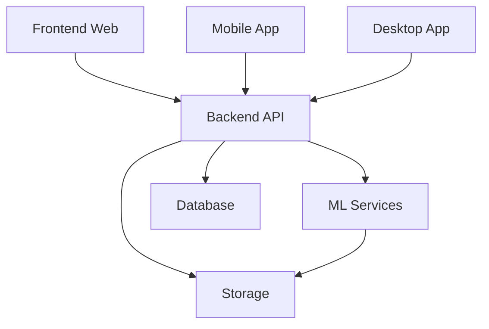

# Структура проекта MemoryVerse

## Репозитории

### [memoryverse-frontend](https://github.com/memoryverse/frontend)
Веб-клиент платформы
- Vue.js 3
- TypeScript
- Tailwind CSS
- GSAP
- Pinia
- Vite

### [memoryverse-backend](https://github.com/memoryverse/backend)
API сервер и бизнес-логика
- Node.js
- Express
- PostgreSQL
- Redis
- AWS S3
- WebSocket

### [memoryverse-mobile](https://github.com/memoryverse/mobile)
Мобильное приложение
- React Native
- TypeScript
- Redux
- React Navigation

### [memoryverse-desktop](https://github.com/memoryverse/desktop)
Десктопное приложение
- Electron
- Vue.js 3
- TypeScript
- SQLite

### [memoryverse-ml](https://github.com/memoryverse/ml)
Сервисы машинного обучения
- Python
- TensorFlow
- PyTorch
- FastAPI

### [memoryverse-infrastructure](https://github.com/memoryverse/infrastructure)
Инфраструктура и деплой
- Terraform
- Docker
- Kubernetes
- GitHub Actions

## Взаимодействие компонентов

## Порты и endpoints

- Frontend: 3000
- Backend API: 4000
- ML Services: 5000
- WebSocket: 4001

## Среды разработки

### Development
- Локальная разработка
- Docker compose
- Моки для ML-сервисов

### Staging
- Тестовая среда
- Kubernetes кластер
- Тестовые данные

### Production
- Продакшен среда
- Kubernetes кластер
- Мониторинг
- Автомасштабирование

## Процесс разработки

1. Разработка ведется в feature-ветках
2. Pull Request в dev-ветку
3. Автоматические тесты
4. Code review
5. Merge в dev
6. Деплой на staging
7. Тестирование
8. Merge в main
9. Деплой на production

## Коммуникация между сервисами

### Синхронная
- REST API
- GraphQL (планируется)

### Асинхронная
- WebSocket
- Redis pub/sub
- Message Queue (планируется)

## Мониторинг и логирование

### Системы
- Prometheus
- Grafana
- ELK Stack
- Sentry

### Метрики
- Latency
- Error rates
- Resource usage
- Business metrics

## Безопасность

### API Gateway
- Аутентификация
- Rate limiting
- CORS
- SSL/TLS

### Данные
- Шифрование в покое
- Шифрование в пути
- Бэкапы
- Аудит

## Масштабирование

### Горизонтальное
- Kubernetes
- Load Balancing
- Service Discovery

### Вертикальное
- Resource Limits
- Auto-scaling
- Performance Optimization

## Документация

### Техническая
- API документация (Swagger)
- Архитектурные диаграммы
- Sequence диаграммы
- Deployment схемы

### Пользовательская
- Руководства разработчика
- Инструкции по установке
- Примеры интеграции
- Troubleshooting 